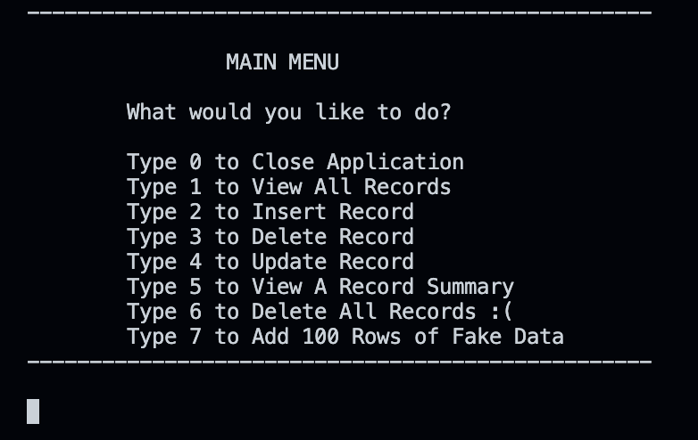

# Habit Logger Project

This is my submission for the cSharpAcademy Habit Logger project found here: https://thecsharpacademy.com/project/12/habit-logger

## Project Description
  - It's a small console CRUD app in which the user can track hobbies which are stored in a local SQLite database.
  - Built with C#/.Net 8

## Usage
  - Follow the instructions and away you go
  - i.e. Select from the menu to perform operations such as: viewing all records, inserting, updating and deleting records.

    <!--  -->
    

## Features
   - Custom data entry including hobby, date, unit and quantity. For example "1 hour of walking, 35 minutes of meditation, 2000 calories of food eaten", etc.
   - If the database doesn't already exist, one will be created and filled with 100 rows of fake data to play with.
   - Limited custom report option which summarizes data by year, hobby or unit (e.g. miles, hours, etc.). 
   - Populate fake data 100 rows at a time.
   - Delete table contents from the main menu.
   - Parameterized SQL queries used throughout.

## More to do
  - I'd like to add more granularity to the custom reports. For example, how many miles of walking did I do in a given month? Or basic math operations like averages.
  - The output could use better formatting. I only just saw that there are plugins that help with this. 

## Questions & Comments
  - The program's structure isn't great. I thought about using OOP but it seemed unnecessary for something so small. For example I can see how Insert, Update and Delete could build off one common function but I wasn't sure how to do it.
  - Which files should I have added to gitignore?
  - The GetRecordSummary() and GetSearchTerm() methods may be a bit unwieldy and I'm not sure how to make them more efficient.
  - Any suggestions on how to clarify my code is greatly appreciated! Program structure is by far the most difficult part for me. Thanks!

Created by Andy Harris - [GitHub Profile](https://github.com/harris-andy)